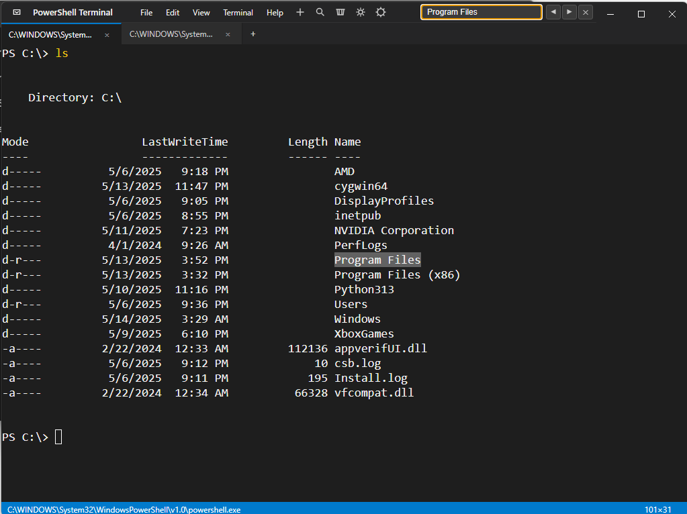

## Project Analysis: electron-xterm-powershell

### 1. Purpose
The project is an advanced terminal emulator built using Electron and xterm.js, providing a PowerShell terminal experience within a desktop application. It allows users to interact with a PowerShell (or bash on non-Windows systems) shell in a customizable and feature-rich environment.

### 2. Key Technologies, Frameworks, and Libraries
*   **Electron:** Used to build the cross-platform desktop application.
*   **xterm.js:** A terminal emulator component for the front-end.
*   **node-pty:** Used to spawn and manage pseudo-terminals, enabling the application to run shell processes.
*   **xterm-addon-fit:** An xterm.js addon that automatically adjusts the terminal size to fit its container.
*   **xterm-addon-search:** An xterm.js addon that provides search functionality within the terminal.
*   **xterm-addon-web-links:** An xterm.js addon that automatically detects and makes web links clickable in the terminal.
*   **xterm-addon-serialize:** An xterm.js addon that allows serializing the terminal's content.
*   **xterm-addon-unicode11:** An xterm.js addon that provides Unicode version 11 support.
*   **fs (Node.js):** Used for file system operations, such as loading and saving settings.
*   **path (Node.js):** Used for constructing file paths.
*   **os (Node.js):** Used to determine the operating system.

### 3. Installation and Running
1.  **Install Dependencies:**
    *   Run `npm install` in the project directory to install the required dependencies.
2.  **Rebuild native modules (if needed):**
    *   Run `npm run rebuild` to rebuild the `node-pty` module for the current Electron version. This is often necessary after upgrading Electron or when encountering issues with the native module.
3.  **Run the Application:**
    *   Run `npm start` to start the Electron application.

### 4. Prerequisites and System Dependencies
*   **Node.js:** Required to install dependencies and run the application. The `package.json` file doesn't specify a required version, but it's likely that a recent version of Node.js (e.g., v18 or later) is needed to support the dependencies.
*   **Electron:** The application is built with Electron, so it can run on Windows, macOS, and Linux.
*   **PowerShell (Windows):** The application defaults to using PowerShell on Windows systems.
*   **Bash (Linux/macOS):** The application defaults to using bash on non-Windows systems.

### 5. File Structure and Key Files
*   `.gitignore`: Specifies intentionally untracked files that Git should ignore.
*   `index.html`: The main HTML file that defines the structure of the user interface.
*   `main.js`: The main process script for the Electron application. It creates the browser window, manages PTY processes, and sets up IPC communication.
*   `package-lock.json`: Records the exact versions of dependencies used in the project.
*   `package.json`: Contains metadata about the project, including dependencies, scripts, and the entry point.
*   `preload.js`: A script that runs in the renderer process before the web page is loaded. It exposes a limited API to the renderer process, allowing it to interact with the main process securely.
*   `renderer.js`: A script that runs in the renderer process and initializes the xterm.js terminal.
*   `styles.css`: Contains the main CSS styles for the application.
*   `src/`: Contains the source code for the application.
    *   `src/css/app.css`: Contains CSS styles specific to the application.
    *   `src/js/app.js`: Initializes the application components and sets up the main event listeners.
    *   `src/js/terminal.js`: Contains the `TerminalManager` class, which handles the creation, configuration, and management of terminal instances.
    *   `src/js/ui.js`: Contains the `UIManager` class, which handles UI interactions and events.